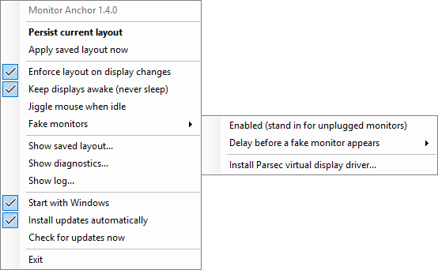
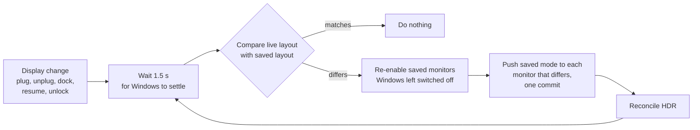
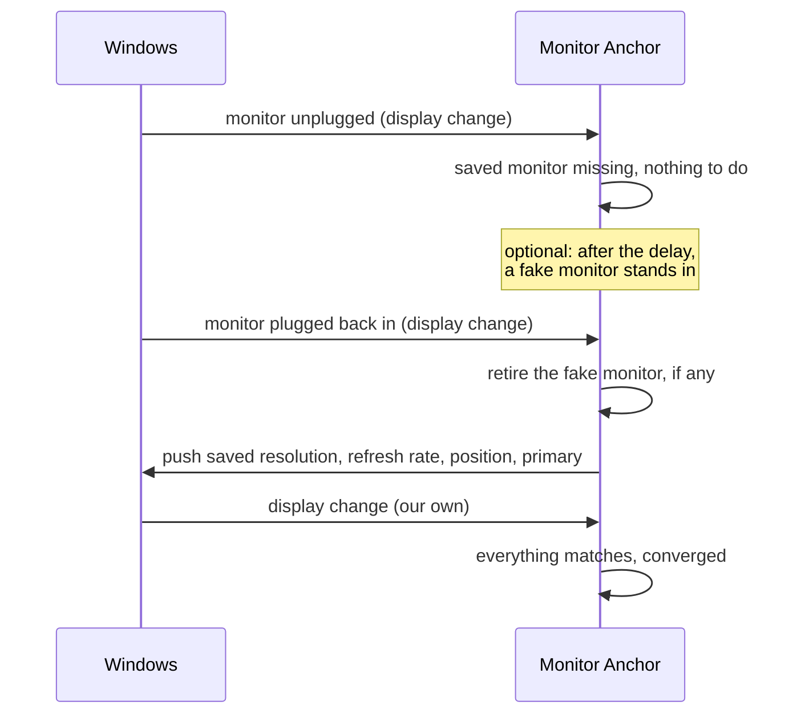
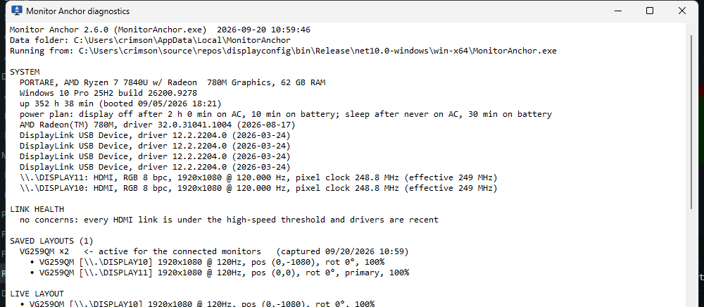
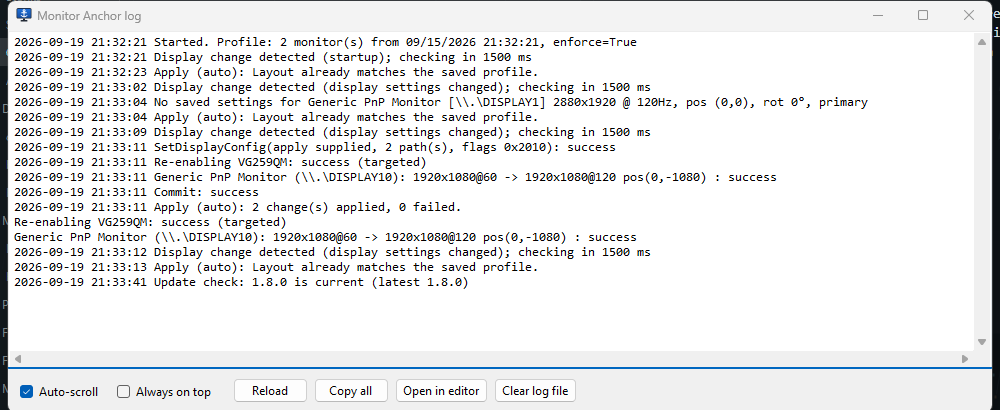
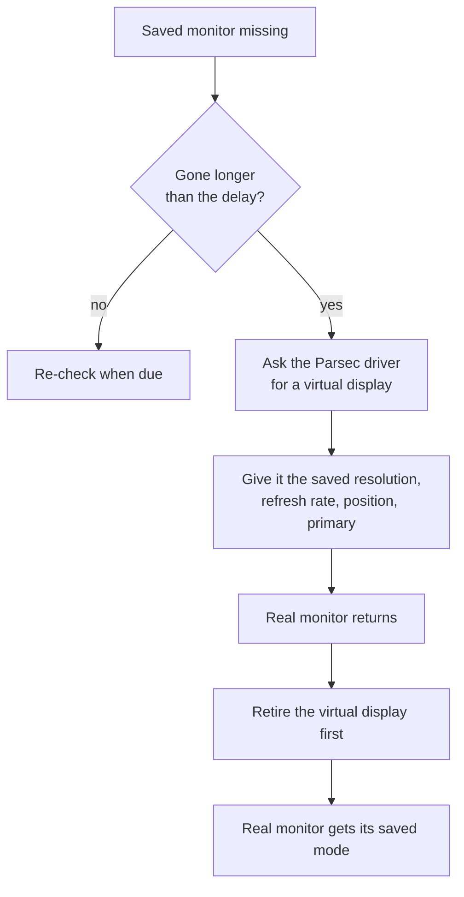

<p align="center">
  
</p>

<h1 align="center">Monitor Anchor</h1>

<p align="center">
  A tiny Windows tray utility that pins your monitor layout.<br>
  Resolution, refresh rate, position, orientation and HDR stay the way you set them, no matter what Windows does.
</p>

<p align="center">
  <a href="https://github.com/guscatalano/MonitorAnchor/releases/latest"></a>
</p>

---

Plug a monitor in, unplug it, dock, undock, switch a KVM, wake from sleep, let a game change the mode: Windows loves to
reshuffle displays afterwards. Monitor Anchor learns the layout you want once and puts it back every time.

<p align="center">
  
</p>

## Install

Download from the [latest release](https://github.com/guscatalano/MonitorAnchor/releases/latest):

| File | Notes |
| --- | --- |
| `MonitorAnchor.exe` | Small build. Needs the [.NET 10 Desktop Runtime](https://dotnet.microsoft.com/download/dotnet/10.0). |
| `MonitorAnchor-selfcontained.exe` | Runtime bundled. Runs anywhere on Windows 10/11 x64. |

Put the exe wherever you want it to live and run it once. It registers itself to start with Windows, learns the layout
you have right now, and from then on keeps it. Rearrange your monitors and choose **Persist current layout** any time
to update the saved layout. Updates install themselves (see below).

## What it does



Monitors are recognised by their device identity (vendor, model and the port they are on), not by the `\\.\DISPLAYn`
number Windows hands out, so a monitor that comes back as `DISPLAY5` instead of `DISPLAY3` is still the same monitor.
A monitor that is connected but not in the saved layout, such as a closed laptop lid, is left alone.

### When a monitor goes away and comes back



Windows 11's own *Remember window locations based on monitor connection* setting moves windows back onto a monitor
that reconnects. Monitor Anchor keeps the monitor identities and layout stable so that feature can do its job.

## The menu

**Actions**

| Item | What it does |
| --- | --- |
| **Persist current layout** | Snapshot every active monitor's mode and HDR state and save it. Double-clicking the icon does the same. |
| Apply saved layout now | Force a restore immediately. |

**Behaviours** (checkmarks)

| Item | What it does |
| --- | --- |
| Enforce layout on display changes | Automatic restore. Off = the app just sits there. On by default. |
| Keep displays awake | Hold the display and system idle timers so the screens never turn off. On by default. |
| Jiggle mouse when idle | After 60 s without keyboard or mouse input, nudges the mouse one pixel and back every half minute so the session and presence indicators keep seeing activity. Off by default. |
| Fake monitors ▸ Enabled | When a saved monitor is unplugged, a virtual monitor takes its place at the same resolution and position so the desktop keeps its shape. Off by default; needs the Parsec Virtual Display Driver. |
| Fake monitors ▸ Delay before a fake monitor appears | Immediately, 5 s, 15 s, 1 min or 5 min (default 10 s). Keeps a quick KVM switch from creating and tearing down fake monitors. |
| Fake monitors ▸ Install Parsec virtual display driver... | Downloads the signed Parsec driver installer and runs it silently (Windows asks for administrator approval). Reads "installed" once the driver is present. |

**Views**

| Item | What it does |
| --- | --- |
| Show saved layout... | What is saved and where the file lives. |
| Show diagnostics... | Everything the app can see, in one window (below). |
| Show log... | Live log viewer: tails the file and auto-scrolls as entries arrive. Scroll up to pause following, Ctrl+End to resume. Always-on-top checkbox, plus buttons to reload, copy, open in your editor, or clear the file. |

**App**

| Item | What it does |
| --- | --- |
| Start with Windows | Run-key registration (on by default after first launch). |
| Install updates automatically | Checks 30 s after start and then daily; a newer release is downloaded (the build matching yours), verified against its size and SHA-256 digest, swapped in place and restarted. On by default. |
| Check for updates now | Asks GitHub for the latest release right away and offers to install it. |
| Exit | Quit. Releases the keep-awake hold and retires any fake monitors. |

### Diagnostics

Saved and live layout, monitor identities, HDR, what is physically connected, each monitor's EDID (handy for telling
whether a KVM passes the real EDID through or emulates its own), driver status, idle time and where every window is.
Refresh, copy to clipboard, or jump to the data folder or log from there.

<p align="center">
  
</p>

### KVM detection

Nothing on a PC says "there is a KVM", but a KVM has a signature: every monitor behind it and the USB keyboard
and mouse disappear in the same instant, and come back together. Monitor Anchor listens for device changes,
pairs monitor disconnects with input-device disconnects inside a three-second window, and logs the result as
**KVM switch away** / **KVM switch back** instead of a generic display change. A burst that also takes hubs,
network or storage with it is logged as **Undocked** / **Docked** instead. Counts are kept across restarts and
summarised in diagnostics, along with whether the monitors' EDIDs look real or emulated.

### Log viewer

Tails the log as the app works, so you can watch a plug, unplug or KVM switch being handled in real time.

<p align="center">
  
</p>

## Command line

All of these run without a tray icon and exit immediately.

| Switch | Effect |
| --- | --- |
| `--persist` | Save the current layout as the profile. |
| `--apply` | Restore the saved profile once. |
| `--dump` | Write the diagnostics report to `dump.txt` in the data folder. |
| `--windows` | Log every visible window's position, size, state and monitor. |
| `--test-enable` | Check, without changing anything, whether disabled-but-connected monitors could be re-enabled in a targeted way. |

Data folder: `%LOCALAPPDATA%\MonitorAnchor\` (`profile.json`, `settings.json`, `log.txt`, `dump.txt`).
The log keeps at most two days of entries (trimmed at startup and hourly) and never grows past 2 MB.

## Fake monitors



Windows cannot invent a monitor without a driver. This mode uses the
[Parsec Virtual Display Driver](https://github.com/nomi-san/parsec-vdd), a signed indirect-display driver that creates up
to eight virtual monitors on request. Virtual monitors never get written into the saved profile, and the driver's
keep-alive ping runs on a background thread while the app runs. Exiting the app retires the fake monitors.

Fake monitors keep the desktop's shape while a monitor is away, which matters for things you launch or remote into
in the meantime. They do not move existing windows: Windows already collapsed those onto the remaining screen the
instant the real monitor vanished, and moves them back itself when it returns.

## Build

Requires the .NET 10 SDK.

```
dotnet publish -c Release -o publish                                   # framework-dependent
dotnet publish -c Release -o publish-sc -p:SelfContained=true          # runtime bundled
```

`tools/make-icon.cs` regenerates `assets/icon.ico` and `icon.png` (run it from inside `tools/`), and
`MonitorAnchor.exe --screenshots assets` re-renders the README screenshots.

## How it works, in detail

* Active monitors are enumerated with `EnumDisplayDevices` / `EnumDisplaySettingsEx`. Each one is keyed by its
  device-interface path (`\\?\DISPLAY#VENDORxxxx#...`), which is stable for a given monitor on a given port. If the
  exact path is not found but exactly one saved monitor has the same vendor/product ID, that entry is used (monitor
  moved to a different port). Ambiguous matches are skipped.
* On `SystemEvents.DisplaySettingsChanged`, resume from sleep, or session unlock, the app waits 1.5 s, then:
  1. Asks the DisplayConfig API which monitors are physically connected. A saved monitor that is connected but not
     part of the desktop is re-enabled with `SetDisplayConfig` using the current active paths plus one path for that
     monitor, so nothing else changes. If Windows rejects that, it falls back to "extend to all".
  2. Compares the live modes against the profile and pushes only the monitors that differ using
     `ChangeDisplaySettingsEx` with `CDS_NORESET`, committing everything in one call. If a display rejects the exact
     refresh rate, resolution and position are still applied.
  3. Reconciles HDR per monitor through `DisplayConfigSetDeviceInfo` (the Windows 11 24H2 HDR call first, then the
     older advanced-colour call), only on monitors that reported HDR support when the profile was saved.
* Restoring triggers another change event; that pass finds everything matching and does nothing. If the driver
  rejects a mode three times in a row, automatic apply pauses for a minute.
* Keep-awake uses `SetThreadExecutionState`; the jiggler uses `GetLastInputInfo` and `SendInput`.
* Updates come from the GitHub releases API. A running exe cannot be overwritten but it can be renamed, so the old
  file is parked as `.old`, the new one moved into place and started, and the parked file deleted on the next start.

Not covered: DPI scaling, colour depth other than what was saved, and clone/duplicate topologies.
